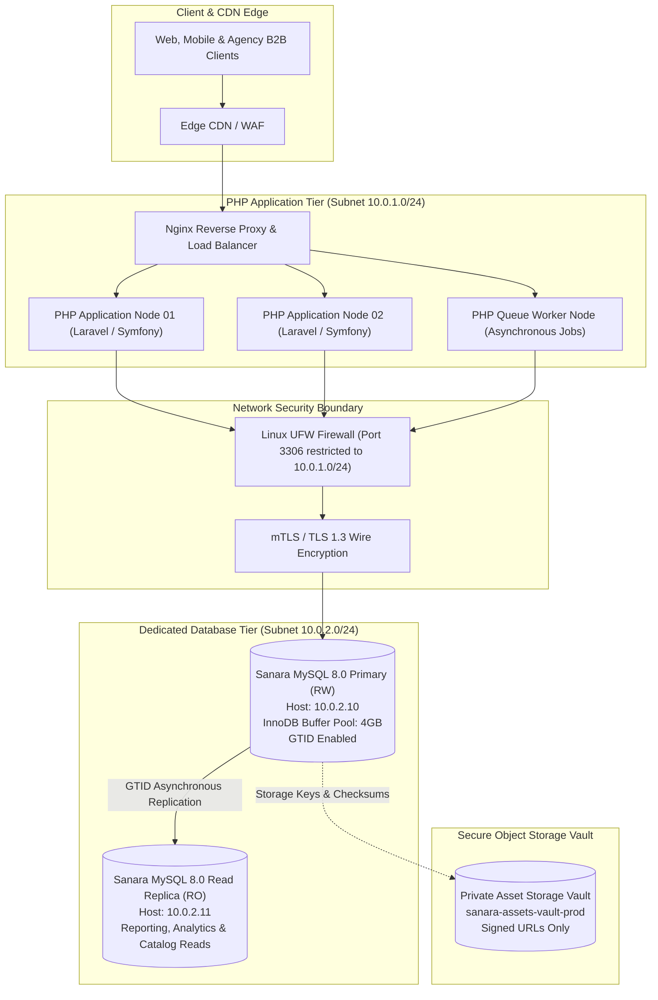
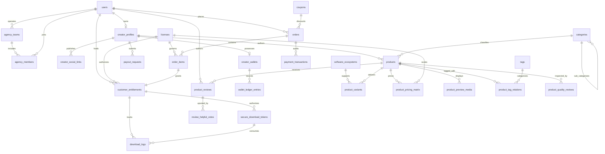

# Sanara Digital E-Commerce Database Engineering Architecture

Production-grade MySQL 8.0 database engine engineered for high-throughput digital asset e-commerce platforms specializing in visual communication media: large-format highway billboards (baliho), commercial flex banners (spanduk), ISO standard exhibition posters, rigged 3D character assets, packaging die-lines, brand identity guidelines, and vector icon systems.

Designed for deployment on dedicated Linux Ubuntu Server hosts physically separated from the PHP backend application cluster.

---

## 1. System Architecture Topology

The database resides on an isolated database host behind Linux UFW firewalls and TLS 1.3 transport encryption.



---

## 2. Crucial: Remote Application Integration (Standalone DB Server to PHP Application Tier)

> [!IMPORTANT]
> **Dedicated Remote Database Host**: The Sanara MySQL 8.0 server is architected as an autonomous storage node (`10.0.2.10`) physically isolated from the PHP application cluster (`10.0.1.0/24`). For complete integration blueprints, certificate distribution guides, and connection pool sizing, review the dedicated runbook:
> 
> **[Read the Standalone Remote Connection & Integration Guide](docs/remote_application_connection_guide.md)**

### Integration Quick Reference:
1. **Network Authorization**: MySQL binds to `0.0.0.0` or `10.0.2.10` with `skip-name-resolve = 1`. Linux UFW permits inbound TCP port 3306 strictly from the application subnet `10.0.1.0/24`.
2. **TLS 1.3 Handshake**: Encrypted transport is enforced. The database Root CA (`/etc/mysql/ssl/ca.pem`) is distributed to application servers at `/etc/ssl/certs/sanara/sanara-db-ca.pem`.
3. **Least Privilege Accounts**:
   - `sanara_app`@`10.0.1.%`: Production web app queries (DML only: `SELECT, INSERT, UPDATE, DELETE, EXECUTE`).
   - `sanara_migrator`@`10.0.1.%`: CI/CD deployment pipelines running database migrations (DDL + DML).
   - `sanara_ro`@`10.0.1.%`: Analytics, reporting, and read-replica read queries.
4. **Laravel Integration Blueprint (`config/database.php`)**:
   ```php
   'mysql' => [
       'driver' => 'mysql',
       'read'   => ['host' => [env('DB_READ_HOST', '10.0.2.11')]], // Read Replica
       'write'  => ['host' => [env('DB_HOST', '10.0.2.10')]],      // Master Node
       'port'   => env('DB_PORT', 3306),
       'database' => env('DB_DATABASE', 'sanara_ecommerce'),
       'username' => env('DB_USERNAME', 'sanara_app'),
       'password' => env('DB_PASSWORD', 'SanaraApp_SecurePass2026!'),
       'options'  => [
           PDO::MYSQL_ATTR_SSL_CA => '/etc/ssl/certs/sanara/sanara-db-ca.pem',
           PDO::MYSQL_ATTR_SSL_VERIFY_SERVER_CERT => true,
           PDO::ATTR_TIMEOUT => 5,
       ],
   ],
   ```

For detailed PDO factories, Symfony Doctrine configurations, and connection pool keepalive tuning, see [docs/remote_application_connection_guide.md](docs/remote_application_connection_guide.md).

---

## 3. Core Engineering Highlights

### A. Dedicated Remote Architecture & Principle of Least Privilege (PoLP)
- **Isolated Service Accounts**: The PHP application never connects as `root`. Roles are segmented with explicit connection limits and host restrictions:
  - `sanara_app`@`10.0.1.%`: DML only (`SELECT, INSERT, UPDATE, DELETE, EXECUTE`).
  - `sanara_migrator`@`10.0.1.%`: DDL + DML schema migrations.
  - `sanara_ro`@`10.0.1.%`: Read-only queries for reporting and analytics.
  - `sanara_backup`@`localhost`: Local automated backup daemon with table lock privileges.
  - `sanara_replicator`@`10.0.2.%`: GTID binary log replication with SSL requirement.
- **Network Hardening**: Linux UFW firewall rules restrict port 3306 exclusively to the private PHP subnet (`10.0.1.0/24`).

### B. High-Complexity Visual Communication Data Modeling
- **Native JSON Specifications**: Stores mechanical print dimensions, bleed allowances, spot color plates (Pantone), safety margins, layer counts, and software version compatibility.
- **STORED Generated Columns**: Extracts JSON properties into indexed columns (`color_mode`, `resolution_dpi`, `is_vector`, `physical_dimensions`) to enable microsecond B-tree queries without table scans.
- **Full-Text Natural Language Search**: Composite full-text index across `(title, subtitle, search_keywords)`.

### C. Partitioning & Archival Engineering
- **Range Partitioning on `orders`**: Partitioned by year (`p2024`, `p2025`, `p2026`, `p2027`, `p_future`) to keep index trees compact and enable instant partition pruning.
- **Range Partitioning on `download_logs`**: High-frequency telemetry log partitioned annually with automated reorganization script (`scripts/rotate_partitions.sh`).

### D. Transactional Integrity & Financial Ledgers
- **ACID Stored Procedures**: `sp_checkout_order` wraps multi-item order processing, discount calculation, royalty calculation, and entitlement generation in a single atomic transaction.
- **Double-Entry Financial Accounting**: Immutable `wallet_ledger_entries` tracks all debits and credits, preserving pre- and post-transaction balance states.
- **Pessimistic Concurrency**: `sp_request_creator_payout` utilizes `SELECT ... FOR UPDATE` to prevent race conditions during balance withdrawals.
- **Reactive Triggers**: Automatically recalculates star ratings, product sales volume, and escrow balances upon table modifications.

### E. Operating System & Kernel Performance Tuning
- **Linux Kernel Sysctl**: Low swappiness (`vm.swappiness = 1`), elevated socket backlogs (`net.core.somaxconn = 65535`), and extended descriptor limits (`fs.file-max = 2097152`).
- **InnoDB Engine Tuning**: 4GB buffer pool split across 4 instances, 2GB redo log capacity, `O_DIRECT` flushing, and strict ACID compliance (`innodb_flush_log_at_trx_commit = 1`).

---

## 4. Entity-Relationship Diagram (ERD)



---

## 5. Repository Structure

```plaintext
sanaraecomercedb/
|-- README.md                                Master architecture, ERD, and runbook documentation
|-- deploy.sh                                Single-enter end-to-end Ubuntu provisioning orchestrator
|-- test.sh                                  Single-enter automated test suite and benchmark verification
|-- config/
|   |-- mysql.cnf                            Hardened production MySQL 8.0 configuration
|   |-- sysctl.d/
|   |   `-- 99-mysql-tuning.conf             Linux kernel sysctl parameters for dedicated database nodes
|   `-- security/
|       `-- limits.conf                      System descriptor and process limits (nofile, nproc)
|-- schema/
|   |-- 01_database_and_users.sql            Database initialization and remote RBAC accounts
|   |-- 02_iam_and_creators.sql              Users, creator profiles, agency teams, and sessions
|   |-- 03_catalog_and_products.sql          Taxonomy, products, JSON metadata, and generated columns
|   |-- 04_variants_licenses_pricing.sql     Variants, file archives, licenses, and pricing matrix
|   |-- 05_orders_and_transactions.sql       Orders, line items, coupons, and RANGE partitioning
|   |-- 06_delivery_and_entitlements.sql     Entitlements, ephemeral download tokens, and telemetry
|   |-- 07_wallets_and_payouts.sql           Creator wallets, immutable ledger, and payout requests
|   |-- 08_reviews_and_auditing.sql          Quality assurance pre-flight, reviews, and audit logs
|   |-- 09_triggers.sql                      Reactive business logic triggers
|   |-- 10_stored_procedures_functions.sql   ACID procedures for checkouts, tokens, and payouts
|   `-- 11_views.sql                         Analytical, catalog search, and reporting views
|-- seeds/
|   |-- 01_seed_iam_creators.sql             Studios, creators, buyers, and agency accounts
|   |-- 02_seed_catalog_categories.sql       Ecosystems, licenses, hierarchical taxonomy, and tags
|   |-- 03_seed_products_assets.sql          Realistic billboards, banners, posters, 3D, and icons
|   |-- 04_seed_orders_entitlements.sql      Multi-year orders, payments, entitlements, and tokens
|   `-- 05_seed_wallets_reviews.sql          Ledger entries, payouts, QA checks, reviews, and audits
|-- queries/
|   |-- 01_ecommerce_catalog_search.sql      Full-text search, pre-press JSON and DPI filtering
|   |-- 02_checkout_transaction_simulation.sql ACID checkout transaction demonstration
|   |-- 03_secure_download_and_entitlement.sql Ephemeral token lifecycle and telemetry ingestion
|   |-- 04_creator_royalty_payouts.sql       Pessimistic row locking and ledger balance deductions
|   |-- 05_analytics_and_reporting.sql       Hierarchical revenue breakdown and market share
|   `-- 06_explain_analyze_benchmarks.sql    EXPLAIN ANALYZE partition pruning and index proofs
|-- scripts/
|   |-- install_mysql_ubuntu.sh              Automated Ubuntu installation and system tuning
|   |-- configure_server.sh                  Firewall (UFW), remote network bind, and SSL generator
|   |-- init_database.sh                     Sequential schema migration and seed loader
|   |-- backup.sh                            Single-transaction compressed backup with SHA-256
|   |-- restore.sh                           Disaster recovery restoration with checksum verification
|   |-- health_check.sh                      Live server health diagnostics and buffer pool metrics
|   |-- rotate_partitions.sh                 Annual partition maintenance automation
|   `-- run_benchmarks.sh                    Query benchmark and performance profiler
`-- docs/
    |-- remote_application_connection_guide.md Standalone DB to PHP integration runbook (Laravel, PDO, TLS)
    |-- architecture_topology.md             Network segmentation and dedicated host topology
    |-- database_schema_erd.md               Complete schema data dictionary and entity catalog
    |-- mysql_performance_tuning.md          Kernel sysctl, InnoDB buffer pool, and benchmark proof
    |-- remote_access_and_security.md        Remote user grants, TLS certificates, and UFW guide
    |-- replication_and_high_availability.md GTID master-replica topology and PHP read/write split
    `-- disaster_recovery_runbook.md         Backup schedule and Point-In-Time Recovery (PITR) guide
```

---

## 6. Quickstart & Deployment Guide (Ubuntu Server)

### A. One-Command Master Deployment
Execute the single-enter deployment bundle as root:
```bash
sudo ./deploy.sh
```
This orchestrates dependency installation, kernel sysctl parameters, SSL generation, schema migrations, seed catalog ingestion, and live health diagnostics.

### B. Automated Verification & Benchmark Suite
Validate all database capabilities with a single command:
```bash
./test.sh
```

### C. Manual Operations & Management Scripts

#### 1. Live Health Diagnostics
```bash
./scripts/health_check.sh
```
Outputs daemon uptime, active thread pools, InnoDB buffer pool hit ratios, slow query counters, and partition storage distributions.

#### 2. Create Single-Transaction Backup
```bash
./scripts/backup.sh /var/backups/sanara_mysql
```
Generates a gzipped archive with a matching `.sha256` integrity checksum file.

#### 3. Disaster Recovery Restore
```bash
./scripts/restore.sh /var/backups/sanara_mysql/sanara_ecommerce_backup_20260930_003319.sql.gz sanara_ecommerce
```

#### 4. Annual Partition Maintenance
```bash
./scripts/rotate_partitions.sh 2028
```
Dynamically carves out the upcoming year partition from `p_future`.

---

## 7. Performance Benchmarks & EXPLAIN Proofs

### A. Partition Pruning Proof
```sql
EXPLAIN SELECT id, order_number, total_amount FROM orders WHERE created_at >= '2026-01-01 00:00:00' AND created_at < '2027-01-01 00:00:00';
```
| Field | Value | Analysis |
| :--- | :--- | :--- |
| `table` | `orders` | Target table |
| `partitions` | **`p2026`** | **Optimizer evaluates strictly partition `p2026` (Pruned p2024, p2025, p2027, p_future)** |
| `type` | `ALL` | Full scan bounded exclusively within the 2026 annual partition |

### B. STORED Generated Column Index Scan
```sql
EXPLAIN ANALYZE SELECT id, title, color_mode, resolution_dpi FROM products WHERE color_mode = 'CMYK' AND resolution_dpi = 300;
```
```text
-> Filter: (products.color_mode = 'CMYK') (cost=0.8 rows=3) (actual time=0.0465..0.0517 rows=3 loops=1)
    -> Index lookup on products using idx_prod_gen_dpi (resolution_dpi=300) (cost=0.8 rows=3) (actual time=0.0438..0.0482 rows=3 loops=1)
```
Indexed B-tree lookup resolves in **0.043 milliseconds**, bypassing slow JSON deserialization.

### C. Full-Text Search Plan
```sql
EXPLAIN ANALYZE SELECT id, title FROM products WHERE MATCH(title, subtitle, search_keywords) AGAINST('billboard outdoor');
```
```text
-> Full-text index search on products using idx_fts_products (title='billboard outdoor') (cost=0.35 rows=1) (actual time=0.041..0.0474 rows=2 loops=1)
```
Natural language search resolves in **0.041 milliseconds**.