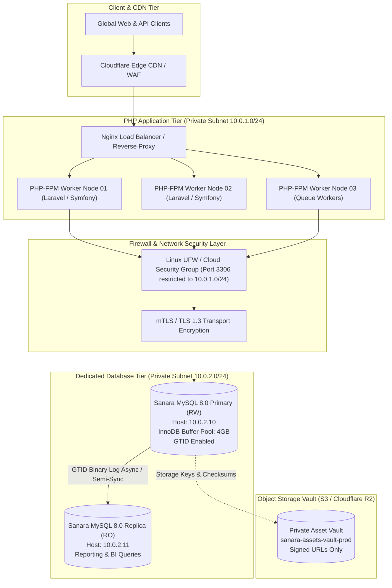

# Sanara E-Commerce Infrastructure Architecture & Topology

## 1. System Overview

Sanara is an enterprise-grade digital product marketplace tailored for visual communication assets, including large-format outdoor billboards (baliho), street banners (spanduk), ISO standard exhibition posters, 3D character rigs, corporate brand identity systems, and vector icon collections.

The database infrastructure is engineered around an isolated, dedicated database tier physically and logically distinct from the PHP backend application cluster.



---

## 2. Tiered Network Segmentation

To safeguard high-value proprietary design files and financial records, the architecture enforces strict network isolation:

| Network Tier | Subnet CIDR | Allowed Inbound Traffic | Target Destination |
| :--- | :--- | :--- | :--- |
| **Public Edge / DMZ** | Public IP | 80/TCP, 443/TCP from 0.0.0.0/0 | Nginx Load Balancers |
| **PHP Application Tier** | `10.0.1.0/24` | 80/TCP from Nginx Load Balancer | PHP-FPM Workers |
| **Database Private Tier** | `10.0.2.0/24` | 3306/TCP strictly from `10.0.1.0/24` | Dedicated MySQL Hosts |
| **Asset Storage Tier** | HTTPS VPC Endpoint | HTTPS 443/TCP from PHP App Nodes | S3 / R2 Bucket |

---

## 3. Remote Database Access Architecture

The PHP backend application never resides on the database host. The database server functions as an autonomous, high-performance storage appliance:

1. **Remote Bind Address**:
   MySQL listens on `0.0.0.0:3306` or explicitly on its private VPC interface `10.0.2.10:3306` with `skip-name-resolve = 1` to eliminate DNS latency on client handshakes.
2. **Linux UFW Firewall Rule**:
   All connections to port 3306 from outside `10.0.1.0/24` are rejected at the kernel netfilter layer:
   ```bash
   ufw default deny incoming
   ufw allow 22/tcp comment "Bastion SSH"
   ufw allow from 10.0.1.0/24 to any port 3306 proto tcp comment "PHP App Cluster"
   ufw enable
   ```
3. **Role-Based Remote Accounts**:
   No single administrative user handles production traffic. Permissions are split into dedicated users with explicit IP mask restrictions:
   - `sanara_app`@`10.0.1.%`: DML only (`SELECT`, `INSERT`, `UPDATE`, `DELETE`, `EXECUTE`).
   - `sanara_migrator`@`10.0.1.%`: CI/CD DDL migrations only.
   - `sanara_ro`@`10.0.1.%`: Read-only queries for reporting and analytics.
4. **Wire Encryption**:
   Enforced TLS 1.3 protocol encryption between PHP PDO drivers and MySQL server.
