# Sanara E-Commerce Database Schema & ERD

## 1. Complete Entity-Relationship Diagram (ERD)

```mermaid
erDiagram
    users ||--o| creator_profiles : "owns"
    users ||--o{ agency_teams : "operates"
    agency_teams ||--o{ agency_members : "includes"
    users ||--o{ agency_members : "joins"
    users ||--o{ orders : "places"
    users ||--o{ customer_entitlements : "holds"
    users ||--o{ product_reviews : "authors"
    users ||--o{ order_refund_requests : "files"

    creator_profiles ||--o{ creator_social_links : "publishes"
    creator_profiles ||--o{ products : "authors"
    creator_profiles ||--o| creator_wallets : "possesses"
    creator_profiles ||--o{ payout_requests : "submits"
    creator_profiles ||--o{ product_collaborators : "contributes"
    creator_profiles ||--o{ collections : "curates"
    creator_wallets ||--o{ wallet_ledger_entries : "records"

    categories ||--o{ categories : "sub_categorizes"
    categories ||--o{ products : "classifies"
    categories ||--o{ contract_asset_allocations : "cleared_in"
    software_ecosystems ||--o{ product_variants : "supports"

    products ||--o{ product_variants : "delivers"
    products ||--o{ product_pricing_matrix : "prices"
    products ||--o{ product_preview_media : "displays"
    products ||--o{ product_tag_relations : "tagged_with"
    tags ||--o{ product_tag_relations : "categorizes"
    products ||--o{ product_quality_reviews : "inspected_by"
    products ||--o{ product_reviews : "receives"
    products ||--o{ product_print_profiles : "specifies"
    products ||--o{ spot_color_plates : "separates"
    products ||--o{ product_collaborators : "split_among"
    products ||--o{ collection_items : "featured_in"

    print_production_profiles ||--o{ product_print_profiles : "standardizes"
    collections ||--o{ collection_items : "bundles"

    agency_teams ||--o{ enterprise_contracts : "negotiates"
    enterprise_contracts ||--o{ contract_asset_allocations : "allocates"

    licenses ||--o{ product_pricing_matrix : "scales"
    licenses ||--o{ order_items : "governs"
    licenses ||--o{ customer_entitlements : "authorizes"

    orders ||--o{ order_items : "contains"
    coupons ||--o{ orders : "discounts"
    orders ||--o{ payment_transactions : "audits"

    order_items ||--|| customer_entitlements : "grants"
    order_items ||--o{ order_refund_requests : "disputed_in"
    customer_entitlements ||--o{ secure_download_tokens : "authorizes"
    customer_entitlements ||--o{ download_logs : "tracks"
    secure_download_tokens ||--o{ download_logs : "consumes"

    product_variants ||--o{ variant_storage_locations : "replicated_across"
    storage_vault_nodes ||--o{ variant_storage_locations : "hosts"

    product_reviews ||--o{ review_helpful_votes : "upvoted_by"
```

---

## 2. Table Catalog & Data Dictionary

### Domain 1: IAM & Multi-Seat Agency Accounts

#### `users`
Central authentication identity repository for customers, creators, art directors, and administrators.
- `id` (BIGINT UNSIGNED, PK): Auto-increment identifier.
- `uuid` (CHAR(36), Unique): UUIDv4 public reference.
- `email` (VARCHAR(255), Unique): Verified login address.
- `password_hash` (VARCHAR(255)): Bcrypt/Argon2 password hash.
- `role` (ENUM): User privileges (`customer`, `creator`, `art_director`, `support`, `super_admin`).
- `status` (ENUM): Account state (`pending`, `active`, `suspended`, `deactivated`).
- `preferred_currency` (CHAR(3)): Default ISO currency.

#### `creator_profiles`
Design studios, freelance illustrators, and large-format print specialists.
- `id` (BIGINT UNSIGNED, PK): Studio identifier.
- `user_id` (BIGINT UNSIGNED, FK): References `users(id)`.
- `studio_name` (VARCHAR(150)): Public brand name.
- `commission_rate` (DECIMAL(5,2)): Retained percentage (e.g. 82.00% to creator, 18.00% to platform).
- `is_verified_creator` (TINYINT(1)): Vetting status by Sanara curation board.
- `total_revenue_usd` (DECIMAL(14,2)): Lifetime earned royalties.

#### `agency_teams` & `agency_members`
Enterprise accounts with pooled licenses and multi-seat permissions for corporate creative teams.

---

### Domain 2: Catalog Taxonomy & High-Complexity Products

#### `categories`
Hierarchical taxonomy tree utilizing materialized path indexing (`/1/2/`):
- Level 1: Outdoor Advertising, Print Media, Brand Identity, 3D Assets, Iconography.
- Level 2: Mega Billboards (Baliho), Vinyl Banners (Spanduk), Posters, Packaging Die-Cuts.

#### `products`
The core catalog table featuring native MySQL 8.0 JSON specifications and STORED generated columns:
- `design_metadata` (JSON): Contains detailed mechanical dimensions, bleed allowances, spot color separations, DPI, layer hierarchies, and software compatibility.
- `color_mode` (VARCHAR(15), STORED GENERATED): Extracted from `design_metadata->>'$.print_specs.color_space'`.
- `resolution_dpi` (SMALLINT UNSIGNED, STORED GENERATED): Extracted from `design_metadata->>'$.print_specs.dpi'`.
- `is_vector` (TINYINT(1), STORED GENERATED): Boolean vector indicator.
- `physical_dimensions` (VARCHAR(50), STORED GENERATED): Dimension string formatted as `{width}x{height} {unit}`.
- `idx_fts_products` (FULLTEXT): Composite full-text search across `(title, subtitle, search_keywords)`.

---

### Domain 3: Licensing & Deliverable Variants

#### `licenses`
Multi-tier commercial rights management:
- `standard`: Single seat, up to 5,000 print impressions.
- `extended`: Single seat, unlimited print runs, commercial merchandise.
- `enterprise`: Unlimited organization seats, nationwide billboard campaigns, broadcast TV.
- `editorial`: Non-profit and news reporting usage.

#### `product_variants`
Deliverable files stored in object storage:
- Formats: `ai`, `psd`, `fig`, `eps`, `blend`, `c4d`, `indd`, `pdf`, `svg`, `zip`, `cdr`.
- Integrity: `archive_checksum_sha256` (SHA-256 integrity hash).
- Storage: `storage_s3_key` pointing to private asset vault.

#### `product_pricing_matrix`
License-dependent price points with computed effective prices:
- `effective_price` (DECIMAL(10,2), STORED GENERATED): `LEAST(COALESCE(sale_price, price), price)`.

---

### Domain 4: Orders, Partitioning & Digital Delivery

#### `orders` (Partitioned by Range on Year)
High-volume transactions partitioned annually to guarantee bounded B-tree depths and partition pruning:
- Partitions: `p2024`, `p2025`, `p2026`, `p2027`, `p_future`.
- `PRIMARY KEY (id, created_at)`: Enforces partition column inclusion.

#### `order_items`
Line items capturing frozen unit price, creator royalty share, and license grant key (`SANARA-XXXX-XXXX-XXXX-XXXX`).

#### `customer_entitlements`
Permanent digital asset ownership records granted upon order completion.

#### `secure_download_tokens`
Ephemeral tokens with IP binding, expiration timestamps (TTL), and maximum download attempt quotas.

#### `download_logs` (Partitioned by Range on Year)
High-frequency telemetry logging every asset delivery attempt, duration, bytes delivered, and HTTP status code.

---

### Domain 5: Financial Ledgers & Quality Assurance

#### `creator_wallets` & `wallet_ledger_entries`
Double-entry accounting ledger tracking:
- `available_balance`: Funds cleared for immediate withdrawal.
- `pending_escrow_balance`: Royalties held during the 14-day dispute clearance window.
- `wallet_ledger_entries`: Immutable audit log with pre- and post-transaction balances.

#### `product_quality_reviews`
Technical pre-flight check records conducted by Sanara Art Directors verifying DPI, color profiles, bleed tolerances, and font outlines prior to publication.

---

### Domain 6: Pre-Press Print Profiles & Creative Collaborations

#### `print_production_profiles`
Industrial print proofing standards specifying substrate properties, Total Area Coverage (TAC), and screening frequencies:
- `profile_name`: E.g. ISO 12647-2 FOGRA39, GRACoL 2013, Heavy Vinyl 510gsm High-UV.
- `substrate_type`: Substrate classification (`vinyl_frontlit_510gsm`, `art_carton_310gsm`, `corrugated_b_flute`).
- `max_ink_density_tac`: Maximum Total Area Coverage ink limit (260% to 320%).

#### `product_print_profiles`
Pivot mapping products to standardized print profiles with exact minimum bleed and safety margin requirements.

#### `spot_color_plates`
Independent ink channels for Pantone Matching System (PMS) inks, metallic foil dies, selective UV varnishes, and structural CAD cutlines.

#### `product_collaborators`
Multi-party royalty split registry enabling lead studios to distribute royalties among contributing specialists (e.g. 3D modeler, typographer, colorist).

---

### Domain 7: Curated Campaign Bundles & Enterprise B2B Contracts

#### `collections` & `collection_items`
Editorial and creator-curated campaign packs combining multiple assets (e.g. Unipole Billboard + Vinyl Spanduk + Rollup Display) with package discounts.

#### `enterprise_contracts` & `contract_asset_allocations`
Master Service Agreements (MSA) for global ad agencies (Ogilvy, Dentsu) with tiered annual guarantees, custom royalty discounts, licensed seats, and category download quotas.

---

### Domain 8: Multi-Cloud Object Storage & Refund Disputes

#### `storage_vault_nodes` & `variant_storage_locations`
Multi-cloud replication registry tracking asset files across AWS S3 primary storage, Cloudflare R2 edge locations, and Wasabi backup archives with health and latency metrics.

#### `order_refund_requests`
Granular line-item dispute and refund arbitration workflows integrated with double-entry accounting chargeback reversals.
