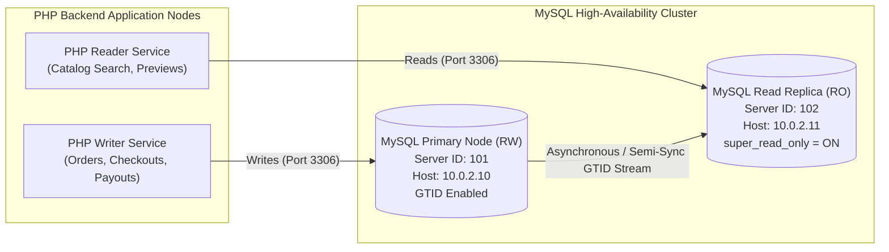

# MySQL 8.0 GTID Replication & High Availability Architecture

## 1. Architecture Topology

To deliver high availability and fault-tolerant horizontal scalability for read-intensive digital asset catalogs, Sanara implements a **Global Transaction Identifier (GTID)** Master-Replica topology.



---

## 2. Master Node Configuration (`config/mysql.cnf`)

On the primary database server (`10.0.2.10`):

```ini
[mysqld]
server-id                       = 101
log_bin                         = /var/log/mysql/mysql-bin.log
binlog_format                   = ROW
binlog_row_image                = FULL
binlog_expire_logs_seconds      = 604800
gtid_mode                       = ON
enforce_gtid_consistency        = ON
log_replica_updates             = ON
```

Replication user provisioning (already incorporated in `schema/01_database_and_users.sql`):
```sql
CREATE USER 'sanara_replicator'@'10.0.2.%' 
    IDENTIFIED WITH caching_sha2_password BY 'SanaraReplica_NodeSync2026!'
    REQUIRE SSL;

GRANT REPLICATION SLAVE, REPLICATION CLIENT ON *.* TO 'sanara_replicator'@'10.0.2.%';
FLUSH PRIVILEGES;
```

---

## 3. Read Replica Node Configuration

On the secondary database server (`10.0.2.11`):

```ini
[mysqld]
server-id                       = 102
gtid_mode                       = ON
enforce_gtid_consistency        = ON
read_only                       = ON
super_read_only                 = ON
log_replica_updates             = ON
binlog_format                   = ROW
```

### Replica Synchronization Bootstrap:
```sql
-- Establish GTID replication stream with automated position discovery
CHANGE REPLICATION SOURCE TO
    SOURCE_HOST = '10.0.2.10',
    SOURCE_PORT = 3306,
    SOURCE_USER = 'sanara_replicator',
    SOURCE_PASSWORD = 'SanaraReplica_NodeSync2026!',
    SOURCE_AUTO_POSITION = 1,
    SOURCE_SSL = 1;

-- Start replication worker threads
START REPLICA;

-- Verify replication state
SHOW REPLICA STATUS\G
```

Key verification fields:
- `Replica_IO_Running: Yes`
- `Replica_SQL_Running: Yes`
- `Seconds_Behind_Source: 0`

---

## 4. PHP Application Read/Write Splitting (Laravel Example)

The PHP application natively dispatches write transactions to the primary node and routes analytical/catalog read queries to the replica node without application code refactoring.

```php
// config/database.php
'mysql' => [
    'driver' => 'mysql',
    'read' => [
        'host' => ['10.0.2.11'], // Replica Node IP
    ],
    'write' => [
        'host' => ['10.0.2.10'], // Primary Master Node IP
    ],
    'port' => 3306,
    'database' => 'sanara_ecommerce',
    'username' => 'sanara_app',
    'password' => 'SanaraApp_SecurePass2026!',
    'charset' => 'utf8mb4',
    'collation' => 'utf8mb4_0900_ai_ci',
    'prefix' => '',
    'strict' => true,
    'engine' => 'InnoDB',
    'options' => [
        PDO::MYSQL_ATTR_SSL_CA => '/etc/ssl/certs/sanara-ca.pem',
    ],
],
```

---

## 5. Failover Procedure

In the event of primary host failure:
1. Promote Replica:
   ```sql
   STOP REPLICA;
   SET GLOBAL read_only = OFF;
   SET GLOBAL super_read_only = OFF;
   ```
2. Re-point application write DNS or virtual IP to `10.0.2.11`.
3. Provision new replica node and initialize with backup snapshot.
